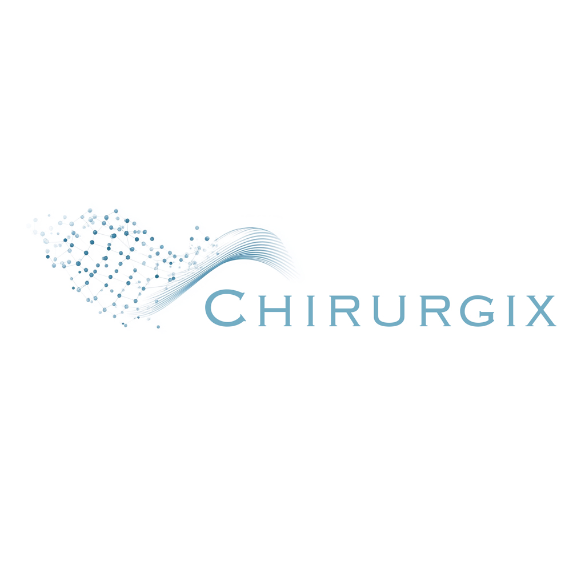
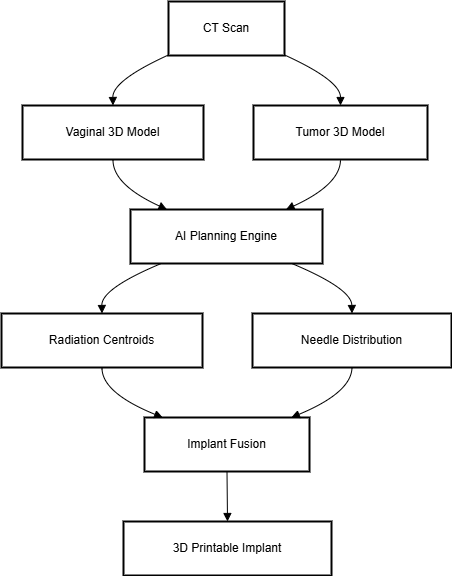

# 
<p align="center">


<p align="center">
  <a href="https://opensource.org/licenses/Apache-2.0">
    
  </a>
</p>

---

## ✨ Overview

**Chirurgix-AnatoGen** is an AI-driven computational framework designed for **patient-specific medical implant synthesis** through **Deep Anatomical Reconstruction** and **Automated Radiation Therapy Planning**. Initially developed for **cervical cancer**, Chirurgix-AnatoGen integrates **AI-powered medical imaging, robotic-assisted therapy, and precision medicine** to enhance oncology treatment planning and execution.

Built on a dataset of **10,000+ clinical cases**, Chirurgix-AnatoGen leverages **unsupervised learning** to optimize radiation source placement, ensuring **higher treatment accuracy while minimizing surgical complexity and organ damage**. Future expansions will include **thoracic oncology, AI-optimized brachytherapy, and nanomedicine-based targeted drug delivery**.

> 🚀 *Transforming AI-driven oncology from research to clinical reality—one patient-specific solution at a time.*

---

# **AI-Powered Medical Implant Generator for Precision Cancer Therapy**

---

## 🔬 Key Features

### **Phase 1: Cervical Cancer Solution**
#### **Clinical Challenge**
Cervical tumors reside deep within the **pelvis**, adjacent to critical structures including the **bladder, rectum, and ureters**. Achieving precise tumor targeting is essential, especially for **advanced-stage cases with deep tissue invasion**. Traditional radiation therapy often struggles to **maintain accurate needle positioning** and optimize **dose distribution**.

#### **AI-Driven Workflow**
##### **1. Patient-Specific 3D Reconstruction**
- AI-powered **CT-based 3D anatomical modeling** for personalized patient implants  
- Vaginal cavity modeling with a minimum CT slice thickness of **≥3mm**  
- **AI-automated tumor segmentation** and volumetric delineation  

##### **2. Automated Treatment Planning**
- Deep learning models trained on **10,000+ real-world oncology cases**  
- **Unsupervised learning approach** generates:  
  - **Optimal centroid coordinates** for tumor targets  
  - **AI-guided brachytherapy needle placement** patterns  
  - **AI-optimized dose concentration maps** that adhere to anatomical constraints  

##### **3. Implant Synthesis & 3D Printing**
- Fusion of **anatomical models** with **radiation source optimization**  
- AI-powered implant modeling based on **tumor morphology and organ positioning**  
- **STL-compatible 3D export** for direct medical 3D printing  

---

## ⚙️ Technical Architecture

```plaintext
Data Pipeline:
CT Scans → 3D Reconstruction → Feature Extraction → AI Model → Implant Design

Components:
1. CT Image Processor       : DICOM to 3D mesh conversion (Python + ITK)
2. Target Delineation Module: Semi-automatic tumor segmentation (PyTorch + MONAI)
3. AI Planner               : Centroid prediction & needle distribution (TensorFlow/Keras)
4. Fusion Engine            : Anatomical constraint-based optimization (OpenCASCADE)
```

<p align="center">
   
</p>

---

## 🚀 Roadmap & Future Plans

### **🚀 Current Milestones**
✅ **AI-Driven Medical Imaging**  
- Fully automated **tumor segmentation and anatomical feature extraction**  
- High-accuracy **3D patient-specific modeling** from CT/MRI scans  

✅ **AI-Powered Smart Biopsy Robotics**  
- Integration of **micro-robotics for autonomous biopsy collection**  
- AI-guided precision **sampling of deep-tissue tumors**  

✅ **AI-Optimized 3D Printed Implants**  
- Generation of **patient-specific, anatomically constrained implants**  
- **Direct STL pipeline for medical-grade 3D printing**  

### **🔜 Future Innovations**
🔹 **Nanoparticle Drug Delivery**  
- AI-driven **biophysics modeling for nanoparticle-based chemotherapy**  
- Optimized **targeted drug release mechanisms** for deep-tissue cancers  

🔹 **Autonomous AI-Guided Treatment Robotics**  
- **Robotic-assisted brachytherapy needle positioning**  
- **Real-time AI feedback** for intraoperative treatment adaptation  

🔹 **AI-Integrated Telemedicine & Remote Oncology Care**  
- Development of **cloud-based AI diagnostic tools** for global oncology networks  
- Secure **edge computing solutions** for AI-powered **remote radiotherapy planning**  

🔹 **Multi-Cancer Expansion (Thoracic & Abdominal Applications)**  
- Adaptation of **Deep Anatomical Reconstruction** for **lung and liver cancers**  
- Integration with **high-dose rate (HDR) brachytherapy planning systems**  

---

## 📃 **Installation & Setup**  

### **📌 Prerequisites**  
- **Python** (3.9+)  
- **Numpy** (1.0.3+)  
- **scikit-learn** (1.5.1+)  
- **torch** （2.1.1）  
- **pydicom**  （2.4.0）  
- **open3d** (0.17.0)  
- **cv2** (4.7.0)  
- **OpenCASCADE** (0.0.12)  

---

## 📞 Contact

- Twitter: [Chirurgix](https://x.com/Chirurgix)  
- GitHub: [Chirurgix](https://github.com/ChirurgixAI/Chirurgix_AnatoGen) 


